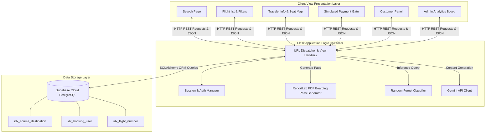

# System Architecture Diagram

This document illustrates the technical design, logical flow, and database index layout of the AI-Enhanced Flight Booking System.

## Architecture Diagram

The system follows a Model-View-Controller (MVC) architectural design pattern using Python Flask as the application controller, SQLAlchemy ORM as the data access layer, and Bootstrap 5 + CSS3 as the client view presentation layer.

## Data Integration & Flow

### 1. Booking Sequence Flow
1. **Search**: The client queries origin, destination, and travel dates. SQLAlchemy filters `flights` table utilizing `idx_source_destination`.
2. **Hold & Reserve**: The client inputs passenger names and clicks an unreserved seat grid node.
3. **Transaction**: The payment gate simulates credentials checks. If approved, a unique `PNR` is generated, database entries are committed to `bookings`, `payments`, and `seat_reservations`, and the seat availability capacity in `flights` is decremented.
4. **Ticket Compilation**: The client requests PDF generation. `ReportLab` loads the transaction record, compiles a standard boarding pass layout, draws a simulated vertical barcode pattern, and returns the binary PDF stream.

### 2. Machine Learning Inference Flow
- **Inputs**: User Route, target Ticket Price, Travel Month, Travel Time Preference, Preferred Airline, Cabin Class, and Booking Frequency.
- **Pre-processing**: Features are encoded using saved `LabelEncoder` parameters from `ml/label_encoders.joblib`.
- **Classification**: The features feed into the `RandomForestClassifier` loaded from `ml/flight_recommendation_model.joblib`.
- **Outputs**: The model outputs the recommended Airline label and the highest class probability as a Confidence Score (%).
- **Historical Tracking**: The prediction is logged in the `recommendations` table and matching active flights are queried and displayed.
